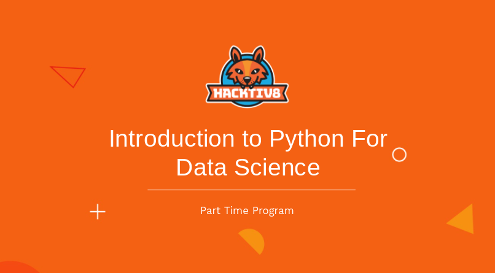

# Intro to Python for Data Science

This is my learning repository for [Intro to Python for Data Science Part-Time Program by Hacktiv8](https://www.hacktiv8.com/parttime/python-basic)

Batch Number: 53

Instructor: [Syahrul Hamdani](https://github.com/syahrulhamdani)

## Sessions

1.  [Introduction: Basic Syntax, Data Type, and Variable](./Sesi01.ipynb)
2.  [Conditions, Control Flow & Looping](./Sesi02.ipynb)
3.  [Function, Basic Module, and Package](./Sesi03.ipynb)
4.  [Numpy](./Sesi04.ipynb)
5.  [Pandas Introduction](./Sesi05.ipynb)
6.  [Data Cleaning with Pandas](./Sesi06.ipynb)
7.  [Basic Visualization](./Sesi07.ipynb)
8.  [Advanced Visualization](./Sesi08.ipynb)
9.  [Descriptive Statistics](./Sesi09.ipynb)
10. [Inferential Statistics](./Sesi10.ipynb)
11. [Regression Models](./Sesi11.ipynb)
12. [Classification I](./Sesi12.ipynb)
13. [Classification II](./Sesi13.ipynb)
14. [Unsupervised](./Sesi14.ipynb)
15. [Model Deployment](./Sesi15.ipynb)
16. Final Projects

## Quizes and Assignments

1.  [Quiz 1](./Quiz01.ipynb)
2.  [Quiz 2](./Quiz02.ipynb)
3.  [Quiz 3](./Quiz03.ipynb)
4.  [Assignment 1](./PYTN_Assgn_1_53_Yoga.ipynb)
5.  [Assignment 2](./PYTN_Assgn_2_53_Yoga.ipynb)
6.  [Assignment 3](./PYTN_Assgn_3_53_Yoga.ipynb)
